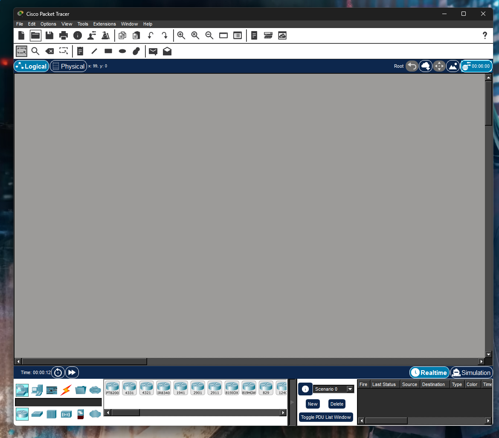
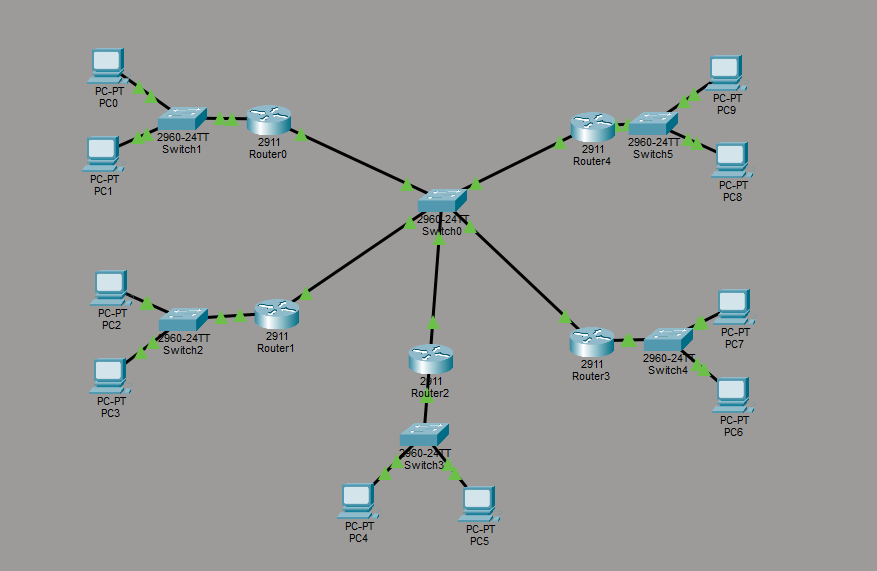

# Задание 1

Вот открытый и работающий Cisco

# Задание 2

Я не ставила прям по 15 компьютеров на каждую сеть, но они рассчитаны с учетом 5 подсетей. Вы это можете увидеть в айпишниках роутера и самих компов. Также вы дали какой-то странный IP в самом задании, поэтому я использовала тот, который мы в остновном использовали на паре 21.09. Вот сама схема:

Файл с самой программы прикреплен в этой же папке под названием hw_cisco.pkt. Можете его просмотреть

# Задание 3

Для рассчета маски /* под 20 подсетей и 10 узлов в каждой нам не хватает IP адрессов. Потому что:

> 256 / 4 = примерно 12

Значит нам надо брать прмиерно 2 в 4 степени (т.е. 16), но тогда нам не хватить месста на 20 подсетей, только на 16.
Меньше мы не можем брать, потому что иначе нам не хватит адрессов в подсети. (это у нас маска будет выходить как /24+4 = /28)

Тогда всего нам надо:

> 20 × 16 = 320 IP адресов

А ближайшая подходящая степень двойки 2 в 9 (т.е. 512)
А это является маской /23.

Из /23 мы можем сделать /28. Их разница:

> 28 - 23 = 5 бит

У нас будет всего 32 подсети, где в каждой по 14 IP для хостов.

**Ответ:** /23 для 32 подсетей и /28 для подсети по 14 устройств.