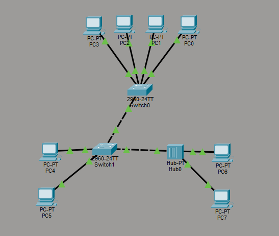
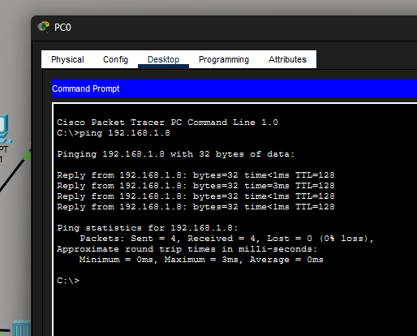
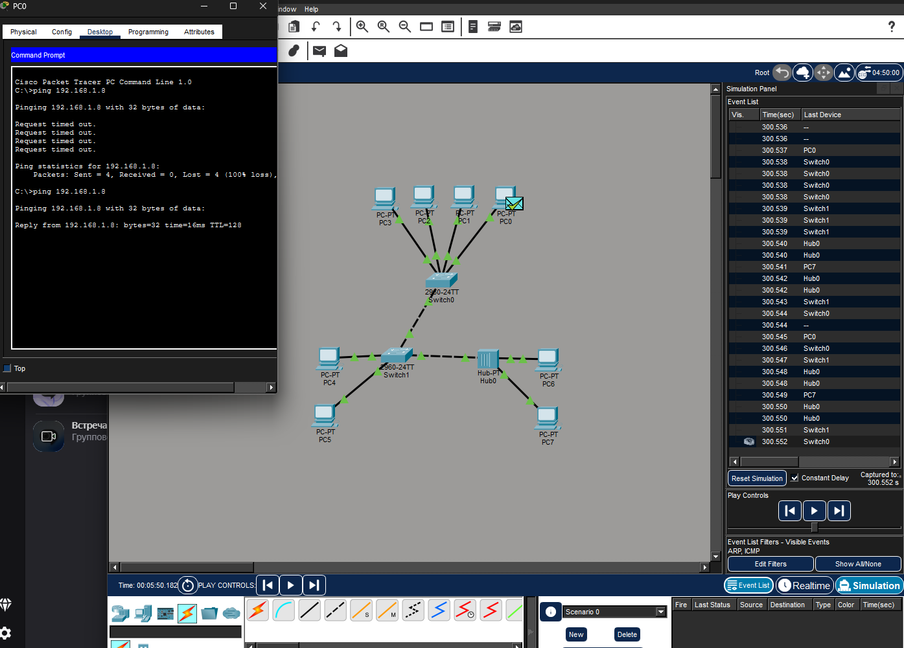

# Задание 1

Схема представлена на рисунке ниже: 

# Задание 2

Работа команды ping в Realtime (Пинговался PC7 с PC0)

# Задание 3

Работа команды ping в Simulation (Пинговался PC7 с PC0)

#

Файл с самой программы прикреплен в этой же папке под названием hw_cisco_2.pkt . Можете его просмотреть при необходимости.